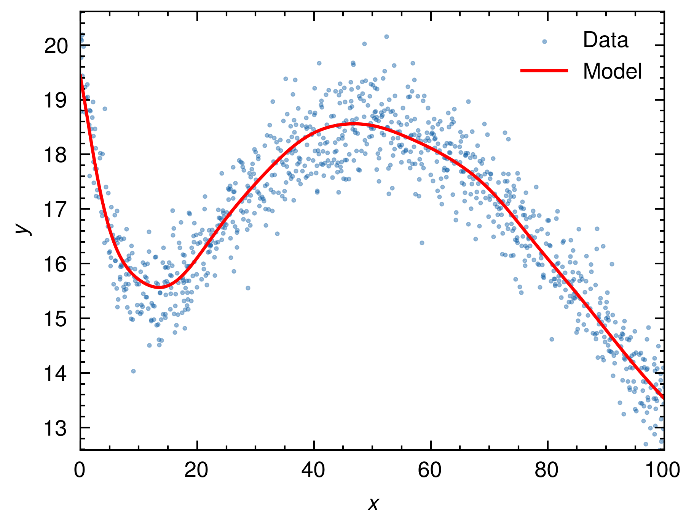

# Noisy Regression with Rust ML Libraries

This project demonstrates how to perform regression on noisy data using various Rust libraries for machine learning. The main libraries used in this project are:

- `peroxide`: A library for data generation, preprocessing and saving
- `candle`: A library for defining and training machine learning models
- `rayon`: A library for parallel processing
- `indicatif`: A library for progress tracking and visualization

## Key Features

1. Dataset Generation and Preprocessing
   - Generate noisy data using the `peroxide` library.
   - Split the data into train, validation, and test sets.
   - Scale the data using scalers such as `MinMaxScaler`, `StandardScaler`, and `RobustScaler`.

2. Model Definition and Training
   - Define an MLP (Multi-Layer Perceptron) model using the `candle` library.
   - Train the model using the Adam optimizer.
   - Track the training progress using the `indicatif` library.

3. Model Evaluation and Visualization
   - Evaluate the trained model on the test dataset and calculate the MSE.
   - Save the test results to a parquet file.
   - Visualize the predictions using `matplotlib`.

## Prerequisites

- Rust
- Python
- Required python libraries
  - `pandas`
  - `pyarrow`
  - `matplotlib`
  - `scienceplots`

## Usage

1. Run the Rust code:

   ```sh
   cargo run --release
   ```

2. Run the visualization script:

   ```sh
   python pq_plot.py
   ```

## Results

- The training and validation losses are printed during the training process.
- The MSE on the test dataset is displayed after the model evaluation.
- The predicted results are visualized and saved to the `test_plot.png` file.
  

## LICENSE

This project is licensed under the MIT license.
